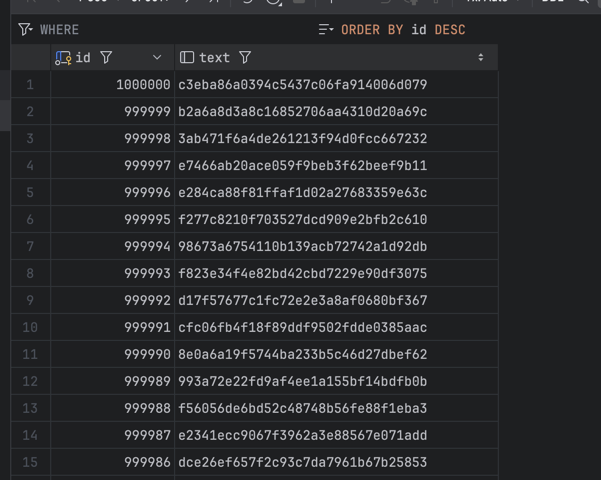
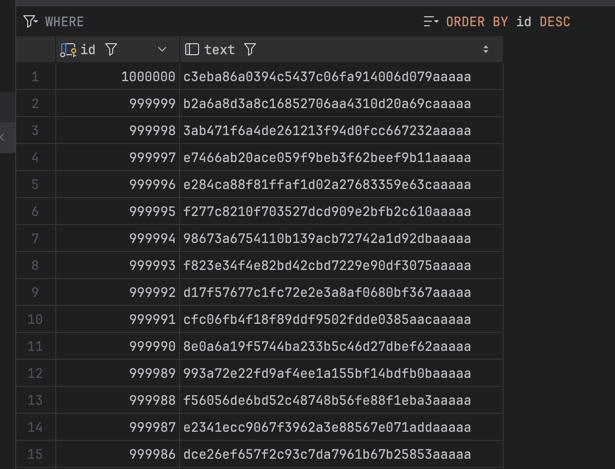
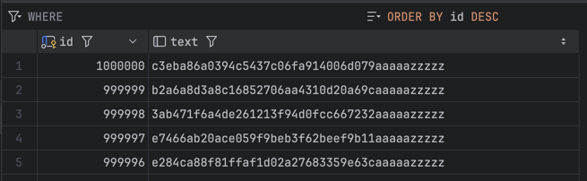
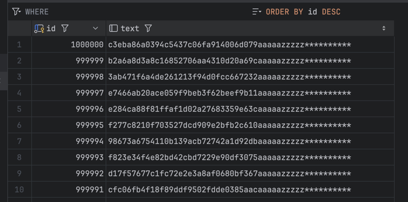

# ДЗ-3:

## Задание:

1. Создать таблицу с текстовым полем и заполнить случайными или сгенерированными данным в размере 1 млн строк
2. Посмотреть размер файла с таблицей
3. 5 раз обновить все строчки и добавить к каждой строчке любой символ
4. Посмотреть количество мертвых строчек в таблице и когда последний раз приходил
   автовакуум
5. Подождать некоторое время, проверяя, пришел ли автовакуум
6. 5 раз обновить все строчки и добавить к каждой строчке любой символ
7. Посмотреть размер файла с таблицей
8. Отключить Автовакуум на конкретной таблице
9. 10 раз обновить все строчки и добавить к каждой строчке любой символ
10. Посмотреть размер файла с таблицей
11. Объясните полученный результат
12. Не забудьте включить автовакуум)

* Задание со *:
Написать анонимную процедуру, в которой в цикле 10 раз обновятся все строчки в искомой таблице.
Не забыть вывести номер шага цикла.

---

## Ответ:

1. Консоль:
```postgresql
create schema if not exists hw3;

create table if not exists hw3.random_texts (
    id      serial primary key,
    text    text
);

insert into hw3.random_texts (text)
select
    md5(random()::text || clock_timestamp()::text || random()::text)
from generate_series(1, 1000000);

select count(id) from hw3.random_texts;
-- 1_000_000
```


2. `87 MB`
```postgresql
select pg_size_pretty(pg_total_relation_size('hw3.random_texts')) AS table_size;
```

3. Консоль:
```postgresql
do $$
declare
    i int := 1;
begin
    while i <= 5 loop
            update hw3.random_texts set text = text || 'a';

            raise notice 'Step % completed', i;
            i := i + 1;
    end loop;
end $$;
```
```shell
Step 1 completed
Step 2 completed
Step 3 completed
Step 4 completed
Step 5 completed
[2024-10-12 14:52:39] completed in 18 s 345 ms
```


4. Консоль:
```postgresql
select
    schemaname as schema,
    relname as table_name,
    n_dead_tup AS dead_rows,
    last_autovacuum
from
    pg_stat_all_tables
where
    relname = 'random_texts';
```

| schema | table\_name | dead\_rows | last\_autovacuum |
| :--- | :--- | :--- | :--- |
| hw3 | random\_texts | 0 | 2024-10-12 11:53:34.155094 +00:00 |

5. Подождать и снова выполнить запрос из пункта 4, автовакуум не приходил или уже очистил:

| schema | table\_name | dead\_rows | last\_autovacuum |
| :--- | :--- | :--- | :--- |
| hw3 | random\_texts | 0 | 2024-10-12 11:53:34.155094 +00:00 |

```postgresql
select name, setting, context, short_desc from pg_settings where category like '%Autovacuum%';
```
| name | setting | context | short\_desc |
| :--- | :--- | :--- | :--- |
| autovacuum | on | sighup | Starts the autovacuum subprocess. |
| autovacuum\_analyze\_scale\_factor | 0.1 | sighup | Number of tuple inserts, updates, or deletes prior to analyze as a fraction of reltuples. |
| autovacuum\_analyze\_threshold | 50 | sighup | Minimum number of tuple inserts, updates, or deletes prior to analyze. |
| autovacuum\_freeze\_max\_age | 200000000 | postmaster | Age at which to autovacuum a table to prevent transaction ID wraparound. |
| autovacuum\_max\_workers | 3 | postmaster | Sets the maximum number of simultaneously running autovacuum worker processes. |
| autovacuum\_multixact\_freeze\_max\_age | 400000000 | postmaster | Multixact age at which to autovacuum a table to prevent multixact wraparound. |
| autovacuum\_naptime | 60 | sighup | Time to sleep between autovacuum runs. |
| autovacuum\_vacuum\_cost\_delay | 2 | sighup | Vacuum cost delay in milliseconds, for autovacuum. |
| autovacuum\_vacuum\_cost\_limit | -1 | sighup | Vacuum cost amount available before napping, for autovacuum. |
| autovacuum\_vacuum\_insert\_scale\_factor | 0.2 | sighup | Number of tuple inserts prior to vacuum as a fraction of reltuples. |
| autovacuum\_vacuum\_insert\_threshold | 1000 | sighup | Minimum number of tuple inserts prior to vacuum, or -1 to disable insert vacuums. |
| autovacuum\_vacuum\_scale\_factor | 0.2 | sighup | Number of tuple updates or deletes prior to vacuum as a fraction of reltuples. |
| autovacuum\_vacuum\_threshold | 50 | sighup | Minimum number of tuple updates or deletes prior to vacuum. |

6. Прогоняю запрос из пункта 3, добавляя символ `z` -> размер стал `524 MB`
```shell
Step 1 completed
Step 2 completed
Step 3 completed
Step 4 completed
Step 5 completed
[2024-10-12 15:07:17] completed in 11 s 2 ms
```
| schema | table\_name | dead\_rows | last\_autovacuum |
| :--- | :--- | :--- | :--- |
| hw3 | random\_texts | 0 | 2024-10-12 12:08:37.531423 +00:00 |



8. Отключил автовакуум:
```postgresql
alter table hw3.random_texts set (autovacuum_enabled = false);
```

9. Добавил символ `*`
```shell
Step 1 completed
Step 2 completed
Step 3 completed
Step 4 completed
Step 5 completed
Step 6 completed
Step 7 completed
Step 8 completed
Step 9 completed
Step 10 completed
[2024-10-12 15:14:51] completed in 31 s 887 ms
```



10. Размер таблицы = `1008 MB`
11. Появились мертвые строчки, ведь автовакуум выключил. Рост таблицы `87 MB` -> `524 MB` -> `1008 MB`

| schema | table\_name | dead\_rows | last\_autovacuum |
| :--- | :--- | :--- | :--- |
| hw3 | random\_texts | 9999975 | 2024-10-12 12:08:37.531423 +00:00 |

12. Включил автовакуум. После включения опции, автоматом не запускался

| schema | table\_name | dead\_rows | last\_autovacuum |
| :--- | :--- | :--- | :--- |
| hw3 | random\_texts | 9999975 | 2024-10-12 12:08:37.531423 +00:00 |

Чуть-чуть подождал, автовакуум запустился.

| schema | table\_name | dead\_rows | last\_autovacuum |
| :--- | :--- | :--- | :--- |
| hw3 | random\_texts | 0 | 2024-10-12 12:24:27.478282 +00:00 |

Время проверить размер таблицы теперь -> `1008 MB`. Не изменился. `VACUUM` не уменьшает размер файла, освобожденные страницы остаются для повторного использования. 
Видимо, чтобы уменьшить физически размер, нужно запустить `VACUUM FULL`


---

## Задание со *:

```postgresql
do $$ 
declare 
    i int := 1;
begin
    while i <= 10 loop
        -- обновляем все строки в таблице table для поля some_column значением some_value
        update table SET some_column = some_value;

        raise notice 'Step %', i;
        i := i + 1;
    end loop;
end $$;
```