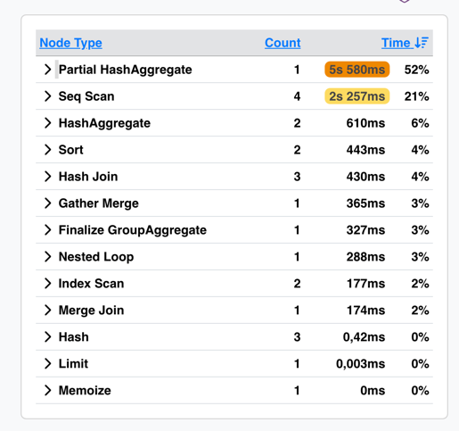
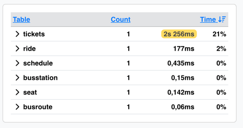
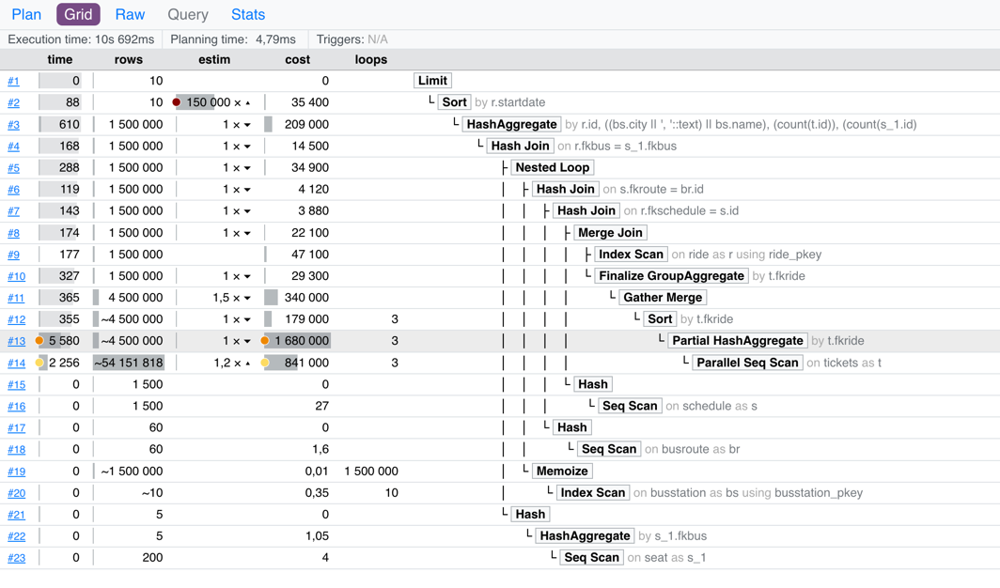
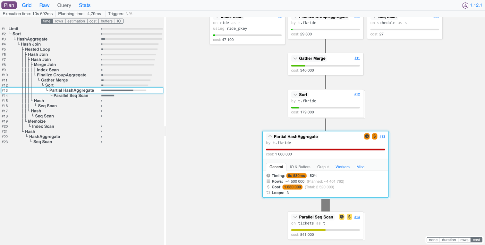
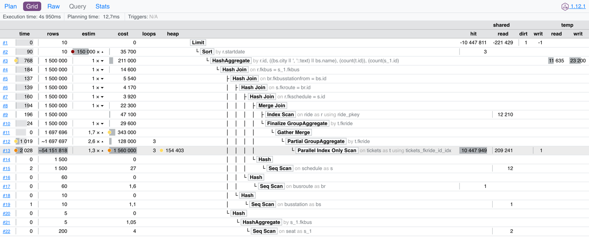
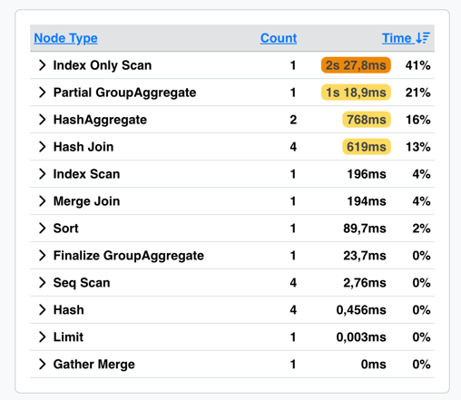

# ДЗ-1:

## Задание:

1. Развернуть ВМ (Linux) с PostgreSQL
2. Залить Тайские перевозки
   https://github.com/aeuge/postgres16book/tree/main/database
3. Проверить скорость выполнения сложного запроса
```sql
WITH all_place AS (
    SELECT count(s.id) as all_place, s.fkbus as fkbus
    FROM book.seat s
    group by s.fkbus
),
order_place AS (
    SELECT count(t.id) as order_place, t.fkride
    FROM book.tickets t
    group by t.fkride
)
SELECT r.id, r.startdate as depart_date, bs.city || ', ' || bs.name as busstation,  
      t.order_place, st.all_place
FROM book.ride r
JOIN book.schedule as s
      on r.fkschedule = s.id
JOIN book.busroute br
      on s.fkroute = br.id
JOIN book.busstation bs
      on br.fkbusstationfrom = bs.id
JOIN order_place t
      on t.fkride = r.id
JOIN all_place st
      on r.fkbus = st.fkbus
GROUP BY r.id, r.startdate, bs.city || ', ' || bs.name, t.order_place,st.all_place
ORDER BY r.startdate
limit 10;
```
4. Навесить индексы на внешние ключ
5. Проверить, помогли ли индексы на внешние ключи ускориться

---

## Ответ:

1. Развернул БД в докере
2. Воспользуюсь мастер БД из дз 5
3. Сначала посмотрим на план запроса через `explain analyze` (раз тут просто селект, то спокойно выполняем explain analyze)
```text
Limit  (cost=3437045.78..3437045.81 rows=10 width=56) (actual time=10650.761..10651.759 rows=10 loops=1)
  ->  Sort  (cost=3437045.78..3440713.92 rows=1467254 width=56) (actual time=10650.758..10651.756 rows=10 loops=1)
        Sort Key: r.startdate
        Sort Method: top-N heapsort  Memory: 26kB
        ->  HashAggregate  (cost=3354672.84..3405338.95 rows=1467254 width=56) (actual time=10302.381..10563.585 rows=1500000 loops=1)
"              Group Key: r.id, ((bs.city || ', '::text) || bs.name), (count(t.id)), (count(s_1.id))"
              Planned Partitions: 32  Batches: 33  Memory Usage: 8209kB  Disk Usage: 96144kB
              ->  Hash Join  (cost=2697757.42..3196026.00 rows=1467254 width=56) (actual time=8166.182..9953.547 rows=1500000 loops=1)
                    Hash Cond: (r.fkbus = s_1.fkbus)
                    ->  Nested Loop  (cost=2697752.31..3181568.43 rows=1467254 width=84) (actual time=8165.827..9784.890 rows=1500000 loops=1)
                          ->  Hash Join  (cost=2697752.16..3146684.10 rows=1467254 width=24) (actual time=8165.654..9496.709 rows=1500000 loops=1)
                                Hash Cond: (s.fkroute = br.id)
                                ->  Hash Join  (cost=2697749.81..3142558.16 rows=1467254 width=24) (actual time=8165.274..9377.911 rows=1500000 loops=1)
                                      Hash Cond: (r.fkschedule = s.id)
                                      ->  Merge Join  (cost=2697704.06..3138649.99 rows=1467254 width=24) (actual time=8163.920..9233.918 rows=1500000 loops=1)
                                            Merge Cond: (r.id = t.fkride)
                                            ->  Index Scan using ride_pkey on ride r  (cost=0.43..47127.43 rows=1500000 width=16) (actual time=0.112..177.077 rows=1500000 loops=1)
                                            ->  Finalize GroupAggregate  (cost=2697703.64..3069431.89 rows=1467254 width=12) (actual time=8163.786..8882.784 rows=1500000 loops=1)
                                                  Group Key: t.fkride
                                                  ->  Gather Merge  (cost=2697703.64..3040086.81 rows=2934508 width=12) (actual time=8163.780..8555.389 rows=4500000 loops=1)
                                                        Workers Planned: 2
                                                        Workers Launched: 2
                                                        ->  Sort  (cost=2696703.61..2700371.75 rows=1467254 width=12) (actual time=8112.601..8190.561 rows=1500000 loops=3)
                                                              Sort Key: t.fkride
                                                              Sort Method: external merge  Disk: 38176kB
                                                              Worker 0:  Sort Method: external merge  Disk: 38176kB
                                                              Worker 1:  Sort Method: external merge  Disk: 38176kB
                                                              ->  Partial HashAggregate  (cost=2286342.53..2521344.92 rows=1467254 width=12) (actual time=5779.577..7835.817 rows=1500000 loops=3)
                                                                    Group Key: t.fkride
                                                                    Planned Partitions: 32  Batches: 33  Memory Usage: 8209kB  Disk Usage: 558112kB
                                                                    Worker 0:  Batches: 33  Memory Usage: 8209kB  Disk Usage: 554392kB
                                                                    Worker 1:  Batches: 33  Memory Usage: 8209kB  Disk Usage: 539656kB
                                                                    ->  Parallel Seq Scan on tickets t  (cost=0.00..840978.76 rows=22561776 width=12) (actual time=0.133..2256.225 rows=18050606 loops=3)
                                      ->  Hash  (cost=27.00..27.00 rows=1500 width=8) (actual time=0.758..0.759 rows=1500 loops=1)
                                            Buckets: 2048  Batches: 1  Memory Usage: 75kB
                                            ->  Seq Scan on schedule s  (cost=0.00..27.00 rows=1500 width=8) (actual time=0.089..0.435 rows=1500 loops=1)
                                ->  Hash  (cost=1.60..1.60 rows=60 width=8) (actual time=0.135..0.135 rows=60 loops=1)
                                      Buckets: 1024  Batches: 1  Memory Usage: 11kB
                                      ->  Seq Scan on busroute br  (cost=0.00..1.60 rows=60 width=8) (actual time=0.054..0.060 rows=60 loops=1)
                          ->  Memoize  (cost=0.15..0.36 rows=1 width=68) (actual time=0.000..0.000 rows=1 loops=1500000)
                                Cache Key: br.fkbusstationfrom
                                Cache Mode: logical
                                Hits: 1499990  Misses: 10  Evictions: 0  Overflows: 0  Memory Usage: 2kB
                                ->  Index Scan using busstation_pkey on busstation bs  (cost=0.14..0.35 rows=1 width=68) (actual time=0.015..0.015 rows=1 loops=10)
                                      Index Cond: (id = br.fkbusstationfrom)
                    ->  Hash  (cost=5.05..5.05 rows=5 width=12) (actual time=0.241..0.241 rows=5 loops=1)
                          Buckets: 1024  Batches: 1  Memory Usage: 9kB
                          ->  HashAggregate  (cost=5.00..5.05 rows=5 width=12) (actual time=0.219..0.220 rows=5 loops=1)
                                Group Key: s_1.fkbus
                                Batches: 1  Memory Usage: 24kB
                                ->  Seq Scan on seat s_1  (cost=0.00..4.00 rows=200 width=8) (actual time=0.099..0.142 rows=200 loops=1)
Planning Time: 4.794 ms
Execution Time: 10691.650 ms
```
- Предпочитаю план визуализировать через https://explain.dalibo.com/





- Проблемные места:
  - Агрегации в `all_place` и `order_place` = сканирование больших таблиц (`seat` и `tickets`) = большое количество строк для обработки
  - Высокие затраты на `Hash Join` и `HashAggregate`
  - `Parallel Seq Scan` на большой таблице

4. Создадим индексы:
   - таблица `tickets` по полям `fkride` и `id`
   - таблица `seat` по полям `fkbus` и `id`
```sql
create index concurrently tickets_fkride_id_idx on book.tickets(fkride, id);
create index concurrently seat_fkbus_id_idx on book.seat(fkbus, id);

-- обновляем статистику
analyze book.tickets;
analyze book.seat;
```
5. Проверяем снова через `explain analyze`
```text
Limit  (cost=2399033.15..2399033.17 rows=10 width=56) (actual time=4940.316..4940.555 rows=10 loops=1)
"  Buffers: shared hit=10447953 read=221466 written=1, temp read=11635 written=23200"
  ->  Sort  (cost=2399033.15..2402737.77 rows=1481850 width=56) (actual time=4940.315..4940.552 rows=10 loops=1)
        Sort Key: r.startdate
        Sort Method: top-N heapsort  Memory: 26kB
"        Buffers: shared hit=10447953 read=221466 written=1, temp read=11635 written=23200"
        ->  HashAggregate  (cost=2315840.77..2367010.90 rows=1481850 width=56) (actual time=4591.528..4850.875 rows=1500000 loops=1)
"              Group Key: r.id, ((bs.city || ', '::text) || bs.name), (count(t.id)), (count(s_1.id))"
              Planned Partitions: 32  Batches: 33  Memory Usage: 8209kB  Disk Usage: 96144kB
"              Buffers: shared hit=10447950 read=221466 written=1, temp read=11635 written=23200"
              ->  Hash Join  (cost=1055.45..2155615.74 rows=1481850 width=56) (actual time=161.479..4083.109 rows=1500000 loops=1)
                    Hash Cond: (r.fkbus = s_1.fkbus)
                    Buffers: shared hit=10447950 read=221466 written=1
                    ->  Hash Join  (cost=1050.34..2141014.40 rows=1481850 width=84) (actual time=161.239..3899.125 rows=1500000 loops=1)
                          Hash Cond: (br.fkbusstationfrom = bs.id)
                          Buffers: shared hit=10447950 read=221464 written=1
                          ->  Hash Join  (cost=1049.12..2135474.77 rows=1481850 width=24) (actual time=160.540..3761.901 rows=1500000 loops=1)
                                Hash Cond: (s.fkroute = br.id)
                                Buffers: shared hit=10447950 read=221463 written=1
                                ->  Hash Join  (cost=1046.77..2131307.79 rows=1481850 width=24) (actual time=160.375..3622.964 rows=1500000 loops=1)
                                      Hash Cond: (r.fkschedule = s.id)
                                      Buffers: shared hit=10447949 read=221463 written=1
                                      ->  Merge Join  (cost=1001.02..2127361.20 rows=1481850 width=24) (actual time=157.802..3460.477 rows=1500000 loops=1)
                                            Merge Cond: (r.id = t.fkride)
                                            Buffers: shared hit=10447949 read=221451 written=1
                                            ->  Index Scan using ride_pkey on ride r  (cost=0.43..47127.43 rows=1500000 width=16) (actual time=1.076..195.865 rows=1500000 loops=1)
                                                  Buffers: shared read=12210
                                            ->  Finalize GroupAggregate  (cost=1000.59..2057960.64 rows=1481850 width=12) (actual time=156.707..3070.379 rows=1500000 loops=1)
                                                  Group Key: t.fkride
                                                  Buffers: shared hit=10447949 read=209241 written=1
                                                  ->  Gather Merge  (cost=1000.59..2028323.64 rows=2963700 width=12) (actual time=156.660..2868.067 rows=1697696 loops=1)
                                                        Workers Planned: 2
                                                        Workers Launched: 2
                                                        Buffers: shared hit=10447949 read=209241 written=1
                                                        ->  Partial GroupAggregate  (cost=0.56..1685239.10 rows=1481850 width=12) (actual time=15.696..3046.720 rows=565899 loops=3)
                                                              Group Key: t.fkride
                                                              Buffers: shared hit=10447949 read=209241 written=1
                                                              ->  Parallel Index Only Scan using tickets_fkride_id_idx on tickets t  (cost=0.56..1557603.82 rows=22563357 width=12) (actual time=0.523..2027.832 rows=18050606 loops=3)
                                                                    Heap Fetches: 154403
                                                                    Buffers: shared hit=10447949 read=209241 written=1
                                      ->  Hash  (cost=27.00..27.00 rows=1500 width=8) (actual time=2.421..2.426 rows=1500 loops=1)
                                            Buckets: 2048  Batches: 1  Memory Usage: 75kB
                                            Buffers: shared read=12
                                            ->  Seq Scan on schedule s  (cost=0.00..27.00 rows=1500 width=8) (actual time=0.624..2.037 rows=1500 loops=1)
                                                  Buffers: shared read=12
                                ->  Hash  (cost=1.60..1.60 rows=60 width=8) (actual time=0.058..0.058 rows=60 loops=1)
                                      Buckets: 1024  Batches: 1  Memory Usage: 11kB
                                      Buffers: shared hit=1
                                      ->  Seq Scan on busroute br  (cost=0.00..1.60 rows=60 width=8) (actual time=0.016..0.021 rows=60 loops=1)
                                            Buffers: shared hit=1
                          ->  Hash  (cost=1.10..1.10 rows=10 width=68) (actual time=0.635..0.635 rows=10 loops=1)
                                Buckets: 1024  Batches: 1  Memory Usage: 9kB
                                Buffers: shared read=1
                                ->  Seq Scan on busstation bs  (cost=0.00..1.10 rows=10 width=68) (actual time=0.614..0.616 rows=10 loops=1)
                                      Buffers: shared read=1
                    ->  Hash  (cost=5.05..5.05 rows=5 width=12) (actual time=0.174..0.181 rows=5 loops=1)
                          Buckets: 1024  Batches: 1  Memory Usage: 9kB
                          Buffers: shared read=2
                          ->  HashAggregate  (cost=5.00..5.05 rows=5 width=12) (actual time=0.162..0.170 rows=5 loops=1)
                                Group Key: s_1.fkbus
                                Batches: 1  Memory Usage: 24kB
                                Buffers: shared read=2
                                ->  Seq Scan on seat s_1  (cost=0.00..4.00 rows=200 width=8) (actual time=0.059..0.084 rows=200 loops=1)
                                      Buffers: shared read=2
Planning:
  Buffers: shared hit=142 read=37 dirtied=1
Planning Time: 12.697 ms
Execution Time: 4950.334 ms
```
5. Индексы помогли, добились `Parallel Index Only Scan` с помощью `tickets_fkride_id_idx`



- Судя по плану запроса, ускорили примерно в 2 раза, но, всё равно ещё медленно. Есть почва для дальнейших оптимизаций
- Если запрос возвращает 1,5 млн. строк, но выводит только первые 10 (Limit), может можно добавить LIMIT и ORDER BY на уровне подзапросов? Не сработает, если для корректности результата необходимы все строки из CTE. 
- Вообщем вся мысль состоит в том, чтобы уменьшить кол-во данных в `all_place` и `order_place`